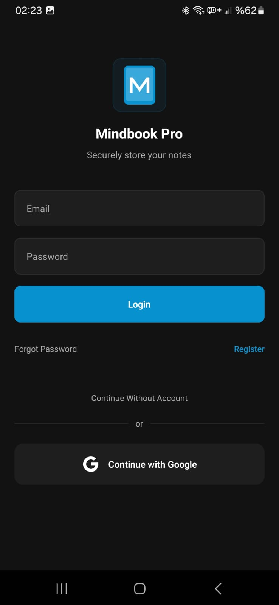
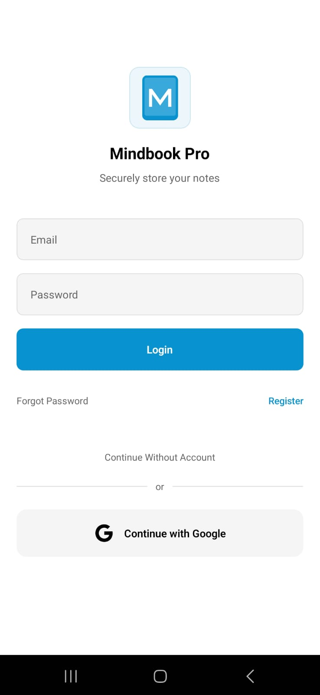
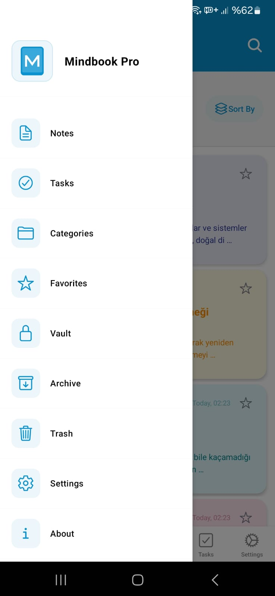

# Mindbook Pro

  

  <b>Secure, Customizable, and Multilingual Note-Taking App</b>

  
  
  
  
  

  <i>This project was developed entirely by a single developer with the assistance of Cursor AI.</i>

## 📱 Screenshots

  <!-- Screenshots will be added here -->
  
  
  

## ✨ Features

- **💫 Rich Text Editor**: Enhanced note-taking experience with full Markdown support
- **🔐 Secure Storage**: Supabase-powered data storage and user authentication
- **🌍 Multilingual Support**: Available in 12 languages for a global user experience:
  - 🇹🇷 Turkish
  - 🇺🇸 English
  - 🇪🇸 Spanish
  - 🇫🇷 French
  - 🇩🇪 German
  - 🇷🇺 Russian
  - 🇨🇳 Chinese
  - 🇯🇵 Japanese
  - 🇰🇷 Korean
  - 🇮🇳 Hindi
  - 🇸🇦 Arabic
  - 🇵🇹 Portuguese (Brazil)
- **🎨 Customizable Themes**: Light/dark mode and customizable color schemes
- **📚 Category Management**: Organize your notes by categories
- **☁️ Backup & Restore**: Cloud-based backup system
- **📊 Statistics**: Analyze your note-taking habits
- **🔒 Encrypted Notes**: Extra layer of security for sensitive information
- **🔍 Advanced Search**: Fast and intelligent search within notes
- **🧰 Biometric Security**: Access control with fingerprint and face recognition
- **🔐 Vault System**: Special encrypted vault for your most important notes
- **🖊️ Pen Support**: Stylus and Apple Pencil compatibility
- **🔄 Real-Time Synchronization**: Instant data synchronization across devices
- **🤖 AI Assistant**: AI-powered assistant for creative writing and note suggestions (Development mode)

## 🛠 Tech Stack

- **Frontend**: React Native, Expo
- **State Management**: Context API
- **Backend & Authentication**: Supabase
- **Storage**: AsyncStorage, Supabase Storage
- **Styling**: Native Styling with React Native
- **Typography**: Custom Font Support
- **CI/CD**: GitHub Actions
- **Testing**: Jest and React Native Testing Library
- **Performance Monitoring**: Custom Performance Metrics
- **AI Model**: Microsoft Phi-1.5 (Flask API Server)
- **Development Assistance**: Cursor AI

## 🔍 Usage

### Creating a Note

To create a new note, tap the "+" button on the main screen. Add a title and content to your note.

### Markdown Usage

Mindbook offers rich Markdown support:

- Headings: `# Heading 1`, `## Heading 2`
- Lists: `- Bullet point` or `1. Numbered item`
- Emphasis: `**bold**`, `*italic*`
- Links: `[text](url)`
- And more...

### Vault Usage

To encrypt your important notes:

1. Tap "Add to Vault" option from the note detail screen
2. Verify your biometric identity or enter your vault password
3. The note will now be securely encrypted

### Theme Customization

From the settings menu, you can switch between light/dark mode and customize accent colors.

## 🤝 Contributing

We welcome contributions! Please open an Issue first to discuss your proposed changes.

1. Fork the repository
2. Create a feature branch (`git checkout -b feature/amazing-feature`)
3. Commit your changes (`git commit -m 'Add some amazing feature'`)
4. Push to the branch (`git push origin feature/amazing-feature`)
5. Open a Pull Request

## 📚 Documentation

Mindbook Pro has comprehensive documentation for different aspects of the project:

- [USER_GUIDE.md](USER_GUIDE.md) - Complete user guide with detailed feature explanations
- [QUICK_START_GUIDE.md](QUICK_START_GUIDE.md) - Get started quickly with essential features
- [FAQ.md](FAQ.md) - Answers to frequently asked questions
- [PRODUCT_ANALYSIS.md](PRODUCT_ANALYSIS.md) - Strategic overview and market positioning
- [LICENSE](LICENSE) - License information

## 🛡️ Compliance & Legal

- [PRIVACY_POLICY.md](PRIVACY_POLICY.md) - Privacy Policy
- [TERMS_OF_SERVICE.md](TERMS_OF_SERVICE.md) - Terms of Service
- [SECURITY_POLICY.md](SECURITY_POLICY.md) - Security Policy
- [RESPONSIBLE_DISCLOSURE.md](RESPONSIBLE_DISCLOSURE.md) - Responsible Disclosure & No Bug Bounty
- [ACCESSIBILITY_STATEMENT.md](ACCESSIBILITY_STATEMENT.md) - Accessibility Statement
- [COOKIE_POLICY.md](COOKIE_POLICY.md) - Cookie Policy
- [GDPR_COMPLIANCE.md](GDPR_COMPLIANCE.md) - GDPR Compliance
- [DMCA_NOTICE.md](DMCA_NOTICE.md) - DMCA Notice
- [COPYRIGHTS.md](COPYRIGHTS.md) - Copyrights
- [CHANGELOG.md](CHANGELOG.md) - Changelog / Release Notes

## 📬 Contact

Melih Can Demir - [@melihcanndemir](https://github.com/melihcanndemir)

Project Link: [https://github.com/melihcanndemir/mindbook](https://github.com/melihcanndemir/mindbook)

## 🧠 Development Approach

MindBook Pro represents an innovative approach to software development:

- **Solo Development**: The entire application was conceptualized, designed, and developed by a single developer.
- **AI-Assisted Development**: All code, architecture, and documentation were created with the assistance of Cursor AI.
- **Comprehensive Documentation**: The extensive documentation demonstrates how AI-assisted development can maintain professional standards.
- **Industry Best Practices**: Despite being a solo project, MindBook Pro adheres to enterprise-level best practices in architecture, security, and testing.

This project showcases the potential of AI-assisted development tools in enabling individual developers to create complex, production-ready applications that previously would have required entire development teams.
